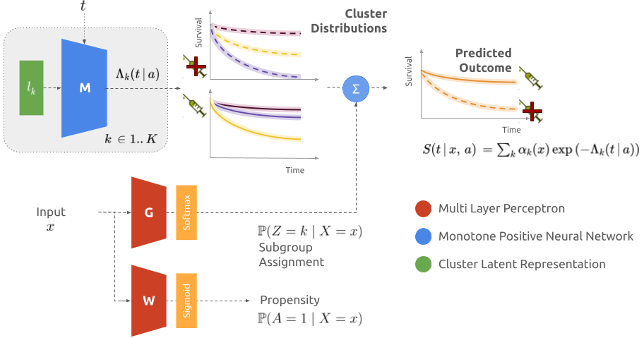

# Causal Neural Survival Clustering
This repository allows to use the model and reproduce the results introduced in [Identifying treatment response subgroups in observational time-to-event data](https://arxiv.org/abs/2408.03463).
This models aim to uncover subgroups of patients with different treatment effects.
Each patient is assigned to a subgroup characterised by two neural networks modelling survival under treatment and control regimes.


## Model
The model consists of three neural networks for estimating the survival distributions: M models the cumulative incidence function under both treatment regimes given a latent representation for each cluster, G assigns each patient to the different subgroups, and W computes the probability to receive treatment to adjust the likelihood for observational study.



## How to use ?
To use the model, one needs to execute:
```python
from cnsc import CausalNeuralSurvivalClustering
model = CausalNeuralSurvivalClustering()
model.fit(x, t, e, a)
model.predict_risk(x, risk = 1)
```
With `x` the covariates, `t` the time of observed events, `e` the associated cause (0 if censored, 1 if the outcome of interest) and `a` the binary treatment.

Then to explore the subgroup strucutre and associated treatmente effects:
```python
model.predict_alphas(x) # Obtain the soft assignment to the different clusters
model.treatment_effect_cluster(horizons) # Compute the survival of the different clusters at different horizons
```

A full example with analysis is provided in `examples/Causal Neural Survival Clustering on METABRIC Dataset.ipynb` using a publicly available dataset for reproducibility. Note that this dataset does not meet the assumptions necessary to estimate treatment effect, and should consequently only be used as a tutorial on how to use the model.

## Reproduce paper's results
To reproduce the paper's results:

0. Clone the repository with dependencies: `git clone git@github.com:Jeanselme/CausalNeuralSurvivalClustering.git --recursive`.
1. Create a conda environment with all necessary libraries `pycox`, `lifelines`, `pysurvival`.
2. Add path `export PYTHONPATH="$PWD:$PWD"`.
3. Run `examples/experiment_cnsc.py SEER`.
5. Analysis using `examples/Analysis CNSC.ipynb`.

In addition `simulations/` contain the different simulation studies proposed in the paper.

## Compare to a new method
Adding a new method consists in adding a child to `Experiment` in `experiment.py` with functions to compute the nll and fit the model.
Then, add the method in `examples/experiment_cnsc.py` and follow the previous point. 

# Setup
## Structure
We followed the same architecture than the [DeepSurvivalMachines](https://github.com/autonlab/DeepSurvivalMachines) repository with the model in `cnsc/` - only the api should be used to test the model. Examples are provided in `examples/`. 

## Clone
```
git clone --recursive git@github.com:Jeanselme/CausalNeuralSurvivalClustering.git
```

## Requirements
The model relies on `pytorch >= 2.0`, `numpy` and `tqdm`.  
To run the set of experiments `auton_survival`, `pycox`, `lifelines`, `pysurvival` are necessary.
